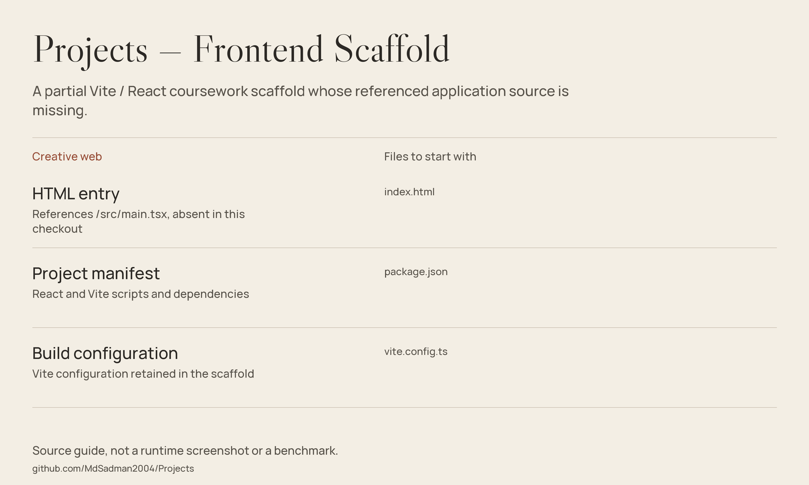

# Projects — Frontend Scaffold

A partial Vite / React coursework scaffold whose referenced application source is missing.



*Source guide drawn from the files in this repository; not a runtime screenshot or a fresh benchmark.*

[Current state](#current-state) · [Source guide](#source-guide) · [Scope & limitations](#scope--limitations)

## Current state

This repository contains the HTML entry point, a Node package manifest and Vite / Tailwind configuration. **It does not include the `src/` directory referenced by `index.html`.** It is therefore a scaffold snapshot rather than a complete runnable application.

For the related ultrasonic-distance presentation, see **[EECE-106](https://github.com/MdSadman2004/EECE-106)**, which contains `src/App.tsx` and `src/main.tsx`.

## Inspect locally

```bash
git clone https://github.com/MdSadman2004/Projects.git
cd Projects
```

Inspect the entry point and package manifest before installing dependencies. The manifest declares `dev`, `build` and `preview`, but those commands cannot produce the intended page until the missing application source is restored.

## What would make this runnable

Restore the actual source files from the intended project, then install dependencies and exercise the declared Vite commands. This documentation update deliberately does not invent replacement application code or merge another repository into it.

## Source guide

| Component | File | Purpose |
| :-- | :-- | :-- |
| HTML entry | [index.html](index.html) | References /src/main.tsx, absent in this checkout |
| Project manifest | [package.json](package.json) | React and Vite scripts and dependencies |
| Build configuration | [vite.config.ts](vite.config.ts) | Vite configuration retained in the scaffold |

## Scope & limitations

There is no real UI screenshot because the committed app source is incomplete. The overview image documents the files and missing-source boundary; it does not represent a working page. No successful build or demo is claimed.

## Reuse & attribution

No standalone repository-wide license file is included in this checkout. Public source access is not a blanket license grant; check provenance and permissions before redistribution.
